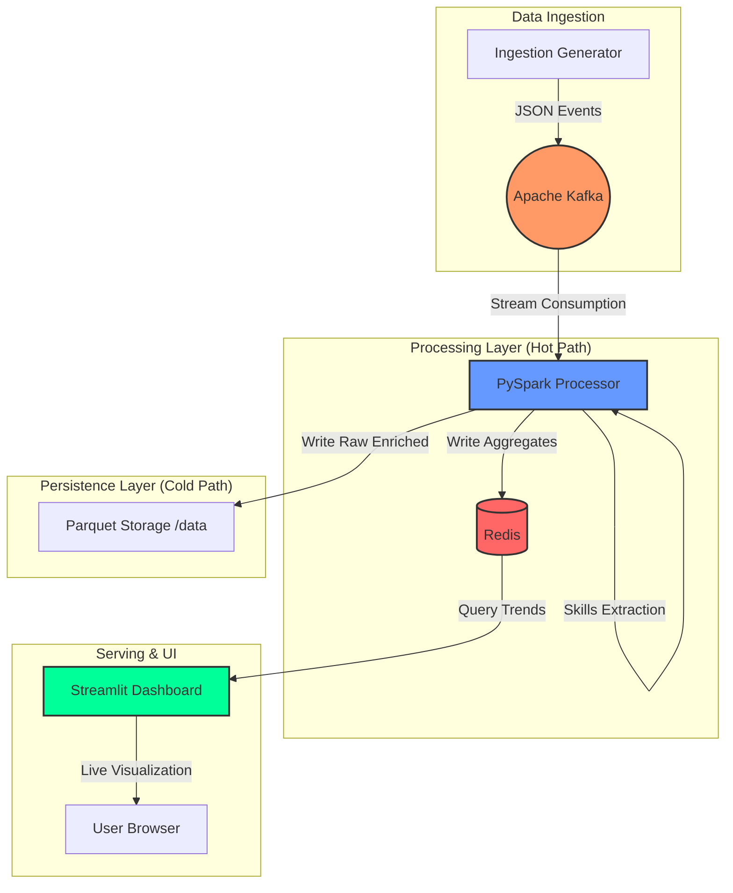
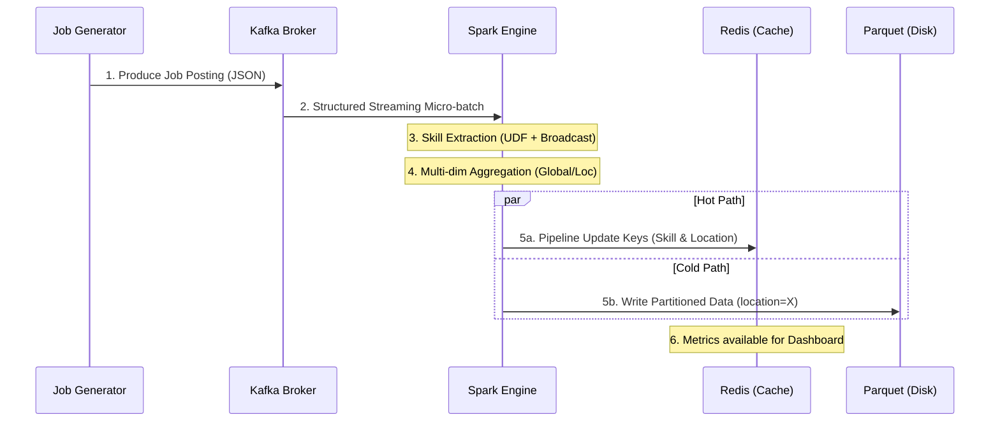

# 🏗️ Global Talent Pulse: Architecture Walkthrough

This document provides a deep dive into the technical architecture, data flow, and design decisions behind the Global Talent Pulse platform.

## 1. System Overview

The project implements a **Lambda Architecture** designed to handle high-velocity streaming data while ensuring reliability and persistent storage.

---

## 2. Data Flow Sequence

The interaction between components follows a strict event-driven pattern.

---

## 3. Component Deep Dive

### 🚀 Spark Processing Engine (`processor.py`)
The heart of the system. It uses **PySpark Structured Streaming** with the following technical highlights:

*   **Broadcast Taxonomy:** The `SKILL_TAXONOMY` (Python, Spark, Kafka, etc.) is broadcasted to all executors to ensure high-performance skill matching within a custom Python UDF.
*   **State Management:** Uses `complete` output mode for Hot Path aggregations, ensuring that skill counters are maintained accurately over the duration of the stream.
*   **Redis Pipelines:** To minimize network latency, Spark uses Redis pipelines to push dozens of location-skill updates in a single network round-trip.
*   **Optimized Shuffle:** Configured with `spark.sql.shuffle.partitions = 2` to fit efficiently into a single-node Docker environment.

### 📥 Kafka Ingestion
Acts as the durable buffer. 
*   **Topic:** `job.postings.v1`
*   **Format:** Avro-like JSON containing unique `event_id`, high-resolution `timestamp`, and job `payload`.

### 📊 Dashboard Layer
A Streamlit-based UI that polls Redis every 2 seconds.
*   **Dynamic Discovery:** Uses Redis `KEYS` patterns to automatically detect new skills or locations added by the Spark engine without needing code changes.
*   **Visulization:** Uses **Plotly Express** for high-framerate, interactive charts.

---

## 4. Key Design Decisions

1.  **Why Redis for Serving?** 
    We chose Redis over querying Parquet directly because the dashboard needs millisecond latency for "Live" updates. Redis's atomic increments and hash structures are ideal for real-time counters.
    
2.  **Why Partitioned Parquet?**
    Data is stored as `file:/data/job_postings_pq/location=Berlin, DE/`. This allows downstream Big Data tools (like Hive or Presto) to skip 90% of files when analyzing specific regions, drastically reducing I/O costs.

3.  **Root User in Docker:**
    We explicitly set `user: root` for Spark services to resolve `IOException: Mkdirs failed` errors common when mounting Windows volumes to Linux containers.

4.  **Fault Tolerance:**
    Spark maintains **Checkpoints** in the local `/data` volume. If a container crashes, it resumes exactly where it left off by reading the WAL (Write Ahead Log) from the checkpoint directory.
