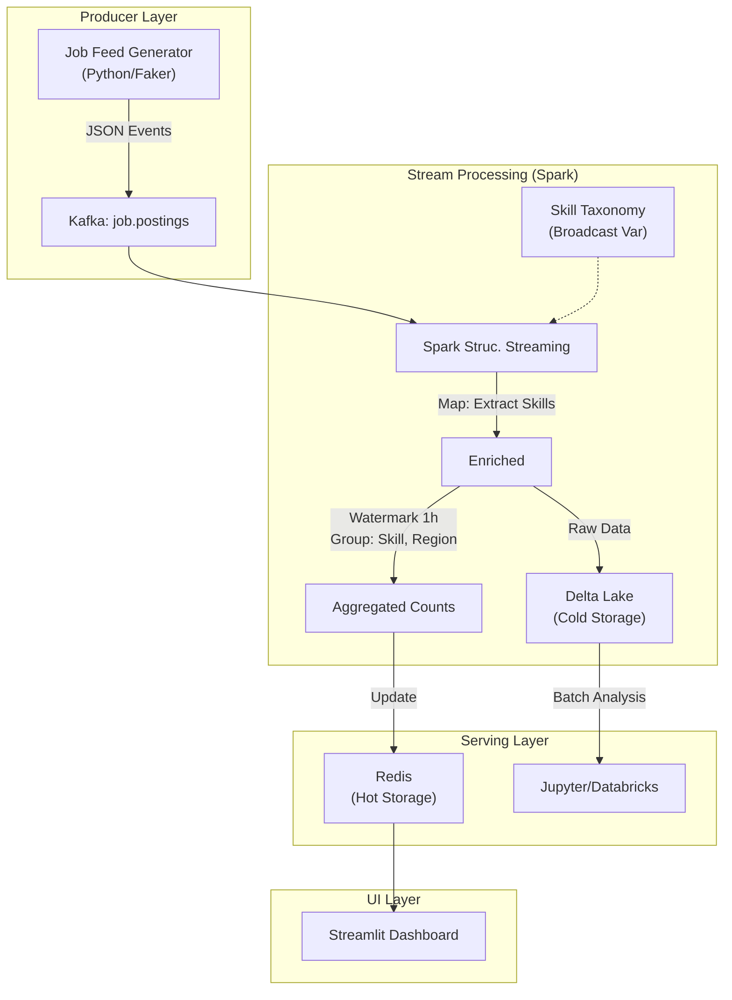

# Technical Blueprint: Global Talent Pulse
## Real-Time Job Market Analytics Platform

### 1. System Architecture

The system follows a modern **Lambda Architecture** (Hot + Cold paths) designed for high-throughput stream processing.



### 2. Data Models & Schemas

#### 2.1 Raw Job Event (Kafka Payload)
*Topic:* `job.postings.v1`
```json
{
  "event_id": "uuid-v4",
  "timestamp": "2024-03-15T10:30:00Z",
  "source": "linkedin_sim",
  "payload": {
    "job_id": "123456",
    "title": "Senior Data Engineer",
    "company": "Tech Corp",
    "location": "London, UK",
    "description": "We need Spark, Kafka, and Python expert...",
    "is_remote": true
  }
}
```

#### 2.2 Enriched Schema (Delta Lake)
*Table:* `silver_job_postings`
*Partition:* `date / region`
```sql
CREATE TABLE silver_job_postings (
    event_id STRING,
    posted_at TIMESTAMP,
    title STRING,
    company STRING,
    skills_array ARRAY<STRING>,  -- extracted: ["Spark", "Kafka", "Python"]
    experience_level STRING,     -- inferred: "Senior"
    region STRING                -- normalized: "UK"
) USING DELTA
PARTITIONED BY (date_posted, region);
```

#### 2.3 Hot Layer (Redis Keys)
*   **Key Pattern:** `trend:{skill}:{region}:{time_window}`
*   **Value:** `Integer (Count)`
*   **Example:** `trend:spark:uk:2024-03-15-10` -> `42`

### 3. Core Components Implementation Details

#### 3.1 Ingestion Service (`/ingestion`)
A Python service mimicking a scraper.
*   **Libraries:** `confluent-kafka`, `faker`
*   **Logic:**
    1.  Generate a simulated job posting (weighted towards tech roles).
    2.  Inject "Chaos" (null locations, malformed dates) to test pipeline robustness.
    3.  Push to Kafka topic `job.postings.v1`.

#### 3.2 Spark Processing Engine (`/spark-jobs`)
The core logic matching your "Big Data" requirement.
*   **Job:** `StreamProcessor.py`
*   **Key Logic - Skill Extraction (The NLP Part):**
    ```python
    # Broadcast the keywords for performance (no external API calls per row)
    keywords = sc.broadcast(["spark", "kafka", "python", "react", "aws"])
    
    @udf(returnType=ArrayType(StringType()))
    def extract_skills(description):
        # fast scanning UDF (O(N) where N is description length)
        found = []
        desc_lower = description.lower()
        for k in keywords.value:
            if k in desc_lower: 
                found.append(k)
        return found
    ```
*   **Key Logic - Windowing:**
    ```python
    # Handle late data up to 2 hours
    df.withWatermark("timestamp", "2 hours") \
      .groupBy(
          window("timestamp", "1 hour"),
          col("skill")
      ).count()
    ```

#### 3.3 Dashboard (`/dashboard`)
*   **Tech:** Streamlit
*   **Charts:**
    *   **"The Pulse":** Line chart of real-time mentions of top 5 skills (Spark vs. Flink) over last 24h.
    *   **"Heatmap":** Map showing skill demand by region.

### 4. Infrastructure (Docker Compose)
Using `docker-compose.yml` for a self-contained portfolio demo.

| Service | Image | Port | Purpose |
| :--- | :--- | :--- | :--- |
| **Kafka** | `confluentinc/cp-kafka` | 9092 | Event Bus |
| **Zookeeper** | `confluentinc/cp-zookeeper` | 2181 | Coordination |
| **Spark Master** | `bitnami/spark` | 8080 | Cluster Manager |
| **Redis** | `redis:alpine` | 6379 | Speed Layer |
| **Generator** | `python:3.9` | - | Data Producer |
| **Dashboard** | `python:3.9` | 8501 | UI |

### 5. Development Plan

1.  **Repo Init:** scaffolding with `poetry`.
2.  **Infra Up:** Get Kafka/Spark running locally.
3.  **Producer:** Write the generator script. Verify Kafka messages.
4.  **Processor:** Write PySpark job. Verify console output first, then Redis sink.
5.  **UI:** Build the Streamlit dashboard.
6.  **Docs:** Write the README explaining the architecture constraints.

---
